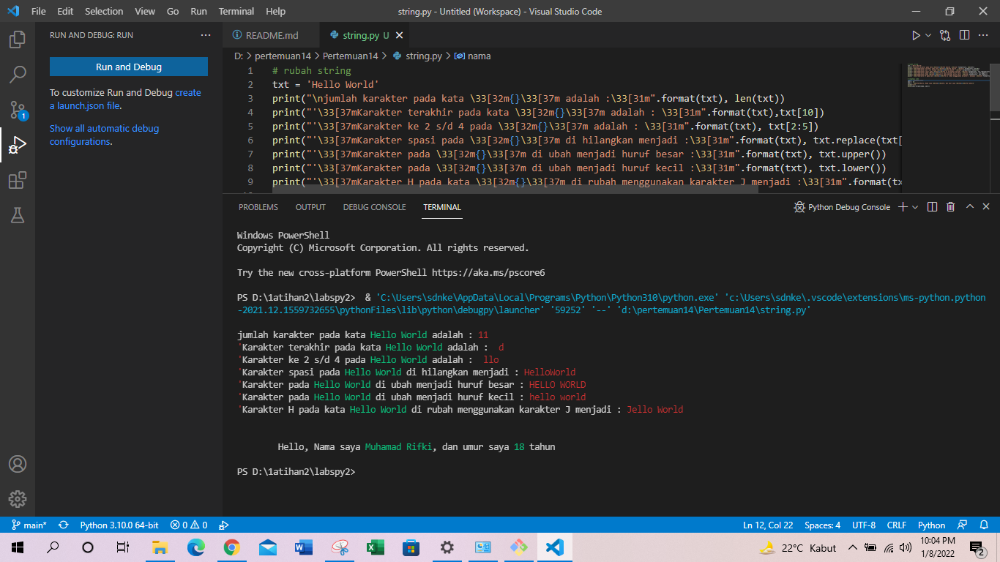

# Pertemuan14
# NAMA  : MUHAMAD RIFKI
# KELAS : TI.21.A.1
# NIM   : 312110205

Apa itu Python String ?

- String adalah urutan simbol yang terbatas yang dipilih dari himpunan yang disebut alfabet.
- String adalah jenis yang paling populer di Python.
- Untuk membuatnya hanya dengan melampirkan karakter dalam tanda kutip.
- Python memperlakukan tanda kutip tunggal sama dengan tanda kutip ganda.
- Membuat string semudah memberi nilai pada sebuah variabel.
string.py
OUTPUT PROGRAM 

Deskripsi
1. Bagaimana menghitung jumlah karakter pada string ?
cara menghitung karakter pada string yaitu menggunakan method len( )
Contoh:

print(len('Hello World'))
methode len() pada python di gunakan untuk menghitung karakter pada string.

2. Bagaimana cara mengambil satu karakter pada string ?
cara mengambil satu karakter pada string yaitu dengan menggunakan kurung siku [ ] dan deklarasi nomor di dalam kurung siku dengan urutan ARRAY dan menggunakan titik dua lalu masukan nomor ARRAY selanjutnya.
Contoh:

print(txt[10])

3. Bagaimana Cara Mengambil Karakter ke 2 s/d 4 ?
cara menggambil karakter 2 s/d 3 menggunakan kurung siku yang di deklarasi nomor ARRAY
Contoh:

print(txt[2:5])

4. Bagaimana cara menghilangkan spasi pada string ?
cara menghilangkan spasi pada string yaitu menggunakan method replace()
contoh:

txt = "Hello World"
print(replace(txt[5]))

methode replace() mengganti semua kemunculan string lama dengan yang baru atau paling banyak kemunculan.

5.Bagaimana cara menguah string menjadi huruf besar atau hurup kecil ?
cara merubah hurup besar/kecil pada string yaitu menggunakan methode:

upper() untuk memperbesar

lower() untuk memperkecil

contoh:

txt = "Hello world"

print(txt.upper()) #memperbesar

print(txt.lower()) #memperkecil

6.Bagaimana cara mengganti karakter pada string ?

Contoh mengganti karaket H menjadi J pada karakter "Hello World" :

txt = "Hello World"

print(replace(txt[:1]))

di sini cara mengganti karakter masih menggunakan method replace( ) dan di deklarasi nomor ARRAY pada kurung siku.
